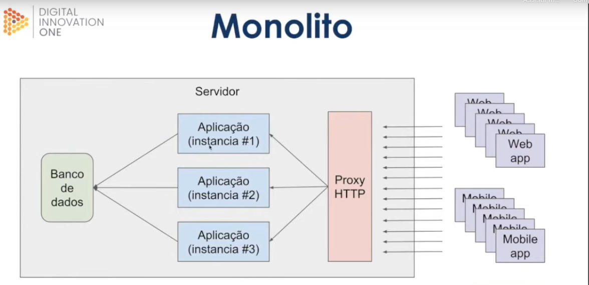
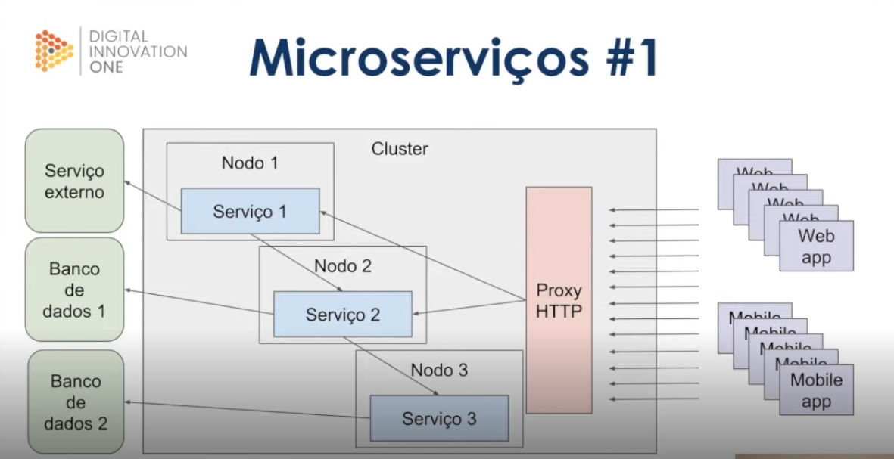
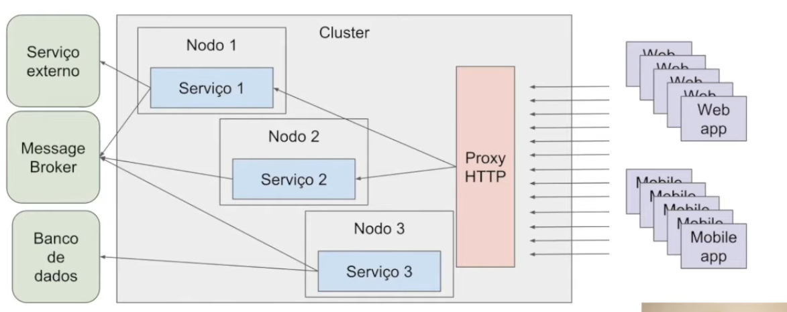
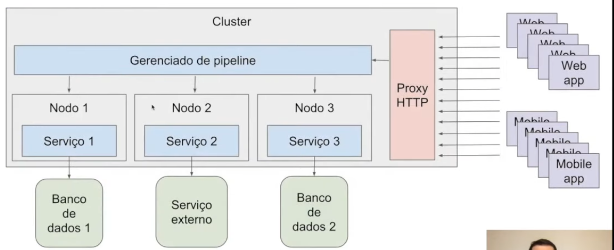
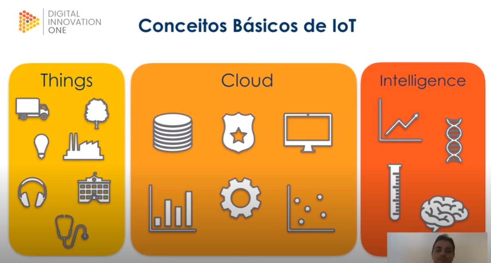
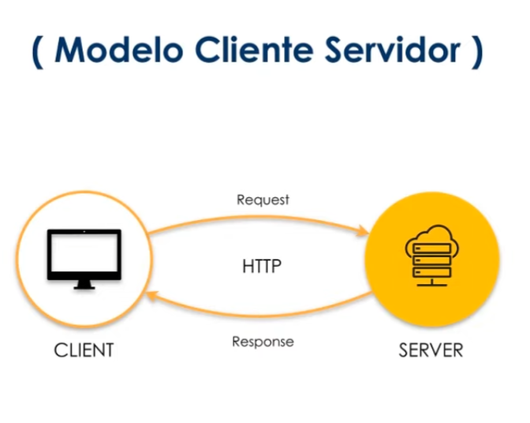
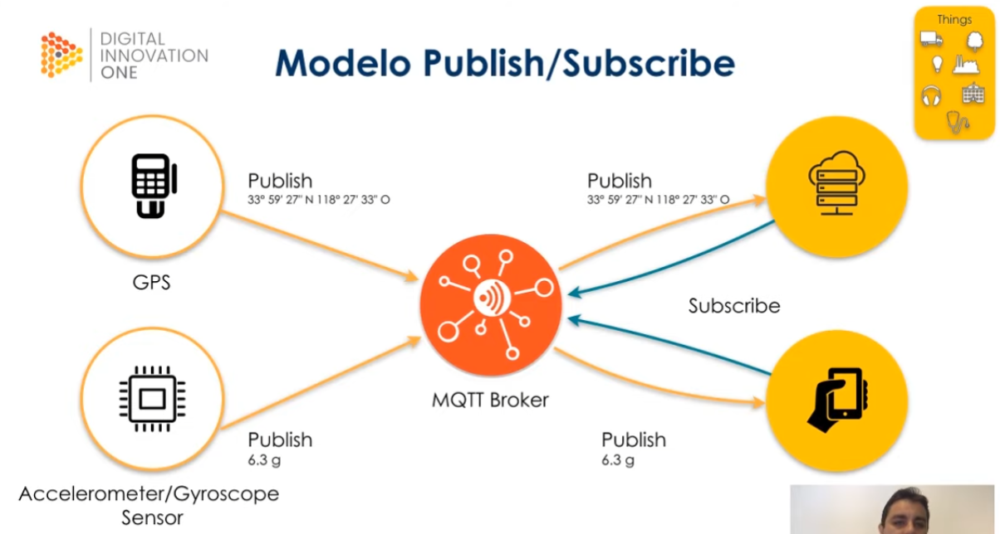
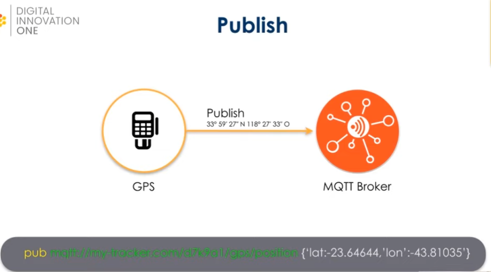

# Vantagens e desenvolvimento de Web Services

## Estrutura *Soap* 

##### 1. O que é SOAP?
- Protocolo simples de acesso ao objeto.
- É baseado em XML para acessar serviços web como o HTTP.
- SOAP é uma definição de como serviços web se comunicam.
- Foi desenvolvido para facilitar integrações entre aplicações.

##### 2. As vantagens de se utulizar SOAP

|Vantagens|
|-|
|Permite integrações entre aplicações, indepentente de linguagem, pois usa o XML como linguagem comum|
|É independente de plataforma e software.|
|É meio de transporte genérico, isso significa que pode ser usado por outros protocolos além do HTTP|

##### 3. O que é XML?
- Dá pra usar sem SOAP, mas SOAP é sempre usado com XML
- Extensible Markup Language, ou seja, é uma linguagem de marcação.
- Facilita a separação de conteúdo através das tags/etiquetas.
- A criação das tags é ilimitada.
- É uma linguagem comum para integrações entre aplicações

##### 4. Entender a estrutura de uma mensagem SOAP

"SOAP Message" deve sempre seguir a mesma estrutura, que é a seguinte:

|SOAP Envelope|
|-|
|[Soap Header]|
|[SOAP Body]|

- SOAP Envelope é o primeiro elemento e é usado para encapsular toda a mensagem SOAP.
- SOAP Header é o elemento onde possui informações de atributos e metadados da requisição - o unico que pode ficar vazio, mas é interessante que esteja preenchido.
- SOAP Body é o elemento que contém os detalhes da mensagem. Tudo o que é de conteúdo na aplicação.
    
## O que é WSDL e XSD

##### 1. O que é WSDL
- Web Services Description Language.
- É basicamente um contrato usado para descrever como o Web Service funciona.
- A descrição é feito em um documento XML, onde é descrito o serviço, especificações de acesso, operações  métodos.
- Seria como um contrato mesmo, pois é nele que as coisas são descritas

##### 2. O que é XSD
- XML Schema Definition
- É usado para definir a estrutura e tipo de dados que terá validade no XML, funciona como uma documentação do SOAP Message que será enviado através de Web Service.
- Define também o que é obrigatório e o que não é.

##### 3. SOAP na prática

Para entender melhor o que vai estar no SOAP, é interessante baixar o SoapUI.

[Ver exemplo de soap](http://www.soapclient.com/xml/SoapResponder.wsdl)

## REST, API e JSON
##### 1. O que é REST
- Transferencia representacional de estado (Representational State Transfer) "Não importa como é, importa como está, ele faz uma representação de como o objeto está no momento que é chamado no Serviço Web
- É um estilo/design de arquiterura para serviços web e software, sempre roda sobre o http, diferente do SOAP que é um protocolo.
- Podem trabalhar com os formatos XML, JSON ou outros tipos de linguagem de marcação

##### 2. Vantagens em se utilizar REST
|Vantagens|
|-|
|Permite integrações entre aplicações e também entre cliente e servidor em páginas web e aplicações.|
|Utiliza dos métodos HTTP para definir a operação que está sendo efetuada.|
|Arquitetura de fácil compreensão.|

##### 3. O que é API
- Application Programming Interface (Interface de programação de aplicações). Quando uma aplicação oferece serviços web, acabamos chamando de API.

- São conjuntos de rotinas documentados e disponibilizados por uma aplicação para que outras aplicações possam consumir suas funcionalidades.
- Ficou popular com o aumento dos serviços web. Existem APIs que não são oferecidos via serviços web, como drives, mas ficaram muito populares por causa dos serviços web.
- As maiores plataformas de tecnologia disponibilizam APIs para acessos de suas funcionalidades, como: Facebook, Twitter, Telegram, Whatsapp, GitHub...
- APIs podem ser REST, SOAP, JSON, rodada via HTTP, pode não seguir a arquitetura REST completa, mas é bem comum que siga.

##### 4. Entendendo os métodos utilizados pelo REST
|Principais métodos HTTP |O que faz:|
|-|-|
|GET|Solicita a representação de um recurso.(Como está naquele momento).|
|POST| Solicita a criação de um recurso.|
|DELETE| Solicita a exclusão de um recurso.|
|PUT| Solicita a atualização de um recurso.|
Para ser um REST tem que seguir a arquitetura, senão não é um REST.

##### 5. Estrutura de um REST
Existe um cliente que está consumindo o serviço e um servidor que está oferecendo o serviço, o cliente faz uma requisição HTTP (GET, POST, PUT, DELETE, etc.), o servidor retorna um código de operação e uma mensagem (Texto, JSON, XML, etc.).  
Quando uma aplicação web disponibiliza um conjunto de rotinas e padrões através de serviços web podemos chamar esse conjunto de API.

|Cliente|x| Servidor|
|-|-|-|
|Envia requisição|-----> |Recebe requisição|
|Recebe retorno|<------|Retorna código ou mensagem|
##### 6. Estrutura de um JSON
- JavaScript Object Notation, mas serve para qualquer linguagem.
- Formatação leve utilizada para troca de mensagens entre sistemas.
- Usa-se de uma estrutura de chave e valor e também de listas ordenadas.
- Junto com XML é uma das mais utilizadas para troca de mensagens em sistemas web.
- Um dos formatos mais populares e mais utilizados para troca de mensagens entre sistemas.
    
        {
            "nome": "Os Vingadores",
            "ano_lancamento": 2019,
            "personagens":[
                {
                    "nome": "Thanos"
                },
                {
                    "nome": "Homem de Ferro"
                },
                {
                    "nome": "Thor"
                },
            ]
        }

## Veja sobre integração com REST e métodos HTTP na prática
##### 1. Integraçao com serviços REST
- Podemos fazer alterações e consultas via JSON também pelo vs code, através de API.
##### 2. Métodos HTTP na prática
- Através da API POSTMAN é possível fazer todas as alterações ou consultas que forem necessárias no HTTP via JSON.
##### 3. Código de estado HTTP
- Usado pelo servidor para avisar o cliente sobre o estado da operação solicitada
- 1xx - Informativo ("Recebeu, mas não foi processada ainda")
- 2xx - Sucesso ("Recebida e processada com sucesso")
- 3xx - Redirecionado {Pouco usada}("Não é mais essa url, agora a url é essa aqui: novaurl.com")
- 4xx - Erro do Cliente ("O cliente colocou uma informação errada")
- 5xx - Erro do Servidor ("Existe, mas não conseguimos processar por um erro no servidor")

É feito dessa forma pois é uma maneira de padronizar as respostas, pois cada servidor pode enviar a resposta de um jeito, mas estando padronizado, é possível o cliente entender melhor e saber se está tudo certo. Assim a requisição feita pelo cliente recebe a mensagem e o status code/código de estado. Além de saber quão bem sucedida foi a requisição no serviço.

[Documentação no MDN.](https://developer.mozilla.org/pt-BR/docs/Web/HTTP/Status)

# Conceitos de arquitetura em aplicações para internet

## Introdução a arquitetura de sistemas
##### 1. Tipos de arquitetura
- Monolito (Tem aplicação única e o proxy HTTP fala com qual instancia da aplicação irá trabalhar, é a arquitetura mais simples).

- Microserviços #1 (É o mais caótico, tem um serviço pra cara operação, cada caixa do Nodo é como se fosse um Monolito diferente, porém os serviços podem se comunicar entre sí e conforme cresce a quantidade de serviços, cresce também o caos).

- Microserviços #2 (Nesse caso existe um Message Broker responsável por centralizar as comunicações que são de um serviço pro outro, a parte ruim é que se tiver problema no Message Broker, a arquitetura fica debilitada).

- Microserviços #3 (A mensagem é passada entre os serviços por um Gerenciador de Pipeline que fica responsável por passar pelo primeiro serviço, depois pelo segundo e assim por diante até devolver a solicitação pro cliente em caso de sucesso ou erro).

## Comparando os modelos Monolito e Microsserviços

###### Monolito

|Prós|Contras|
|-|-|
|Baixa complexidade| Stack única|
|Monitoramento simplificado| Compartilhamento de recursos|
|| Acoplamento das funcionalidades|
|| Mais complexo a escalabilidade|

###### Microserviços #1

|Prós| Contras|
|-|-|
|Stack dinâmica| Acoplamento|
|Simples escalabilidade| Monitoramento mais complexo|
|| Provisionamento mais complexo|

###### Microserviços #2

|Prós| Contras|
|-|-|
|Stack dinâmica| Monitoramento mais complexo|
|Simples escalabilidade| Provisionamento mais complexo|
|Desacoplamento||

###### Microserviços #3

|Prós| Contras|
|-|-|
|Stack dinâmica| Provisionamento mais complexo|
|Simples escalabilidade| Plataforma inteira depende do gerenciador de pipeline|
|Desacoplamento||
|Menor complexidade||

## Gerenciamento de erros e volume de acesso

##### Gerenciamento de erros
Onde é mais complexo:
- Processos assíncronos(Microserviços #2)
- Pipeline

Solução:
- Dead letter queue (coloca o erro em uma nova fila no message broker e dps tenta processar novamente)
- Filas de re-tentativas

# A arquitetura de aplicações móveis e internet das coisas

## Conceitos da Internet das Coisas
##### Internet das coisas

###### Por que conectar as coisas?
- Embutir sensores em objetos do dia-a-dia
- Coletar dados dos sensores
- Usar o dado para tomar decisão

###### Conceitos básicos de IoT

Alguns exemplos de aplicação da IoT são: os Smart Building, as Smart Home, Wearables, na Agricultura, Smart Transportation, Cadeia de suprimentos (RDIF Supply Chain) e Energia eficiente.

Computação Ubíqua são os computadores saindo das nossas vistas e mesmo assim estando presentes em todas as areas.

###### Desafios da internet das coisas
1. Privacidade e Segurança
1. Quantidade exponencial de dispositivos conectados na rede
1. Ser capaz de processar e armazenar uma enorme quantidade de informações
1. Gerar valor a partir dos dados coletados.

## Arquitetura da internet das coisas e protocolo de comunicação

###### Considerações de atributos antes de fazer uma escolha de onde vai coletar os dados
- Baixo consumo de energia
- Rede de dados limitado
- Resiliencia (do device ex.: buffer para guardar os dados antes de transmitir quando não tem conexão com rede)
- Segurança
- Customização
- Baixo custo

##### Exemplos de plataformas: 
###### Arduino
- Plataforma de prototipagem
- Com entradas e saídas
- Desenvolvedor escreve em C/C++
- Interface serial ou USB
- Shields (componentes de conectividade)

###### Embarcados - MCUs

- Microcontrolador de chip único
- Sistema operacional real time (fala com o hardware e entrega o processamento dentro de certos limites aceitáveis)
- Embarcado
- Uso industrial, médico, militar, transporte
###### Minicomputadores - Raspberry Pi

- Computador completo
- Hardware integrado em uma única placa
- Roda SO Linux ou Windows
- Uso doméstico e comercial

###### **O protocolo mais utilizado com IoT é o *MQTT***
Tanto um smartphone quanto um gps tracker usando um SO Real Time (FreeRTOS) conseguem se comunicar
###### MQTT
- Base na pilha do TCP/IP
- Protocolo de mensagem assíncrona (M2M - Machine to Machine) [envia e não fica esperando uma resposta]
- Criado pela IBM para conectar sensores de pipelines de petróleo a satélites
- Padrão OASIS suportado pelas linguagens de programação mais populares
###### Modelo Cliente-Servidor
modelo sincrono

###### Modelo usado pelo MQTT

como mqtt publica a mensagem

## Flexibilidade dos tópicos de Cloud

## Estudo de caso

# Conceitos de responsibidade e experiencia do usuário

## Tópicos introdutórios sobre UX e UI

## Cores da interface

## Componentes da interface do Usuário

## Como aplicar os conceitos em projetos

## Bibliografia complementar e dicas do especialista
